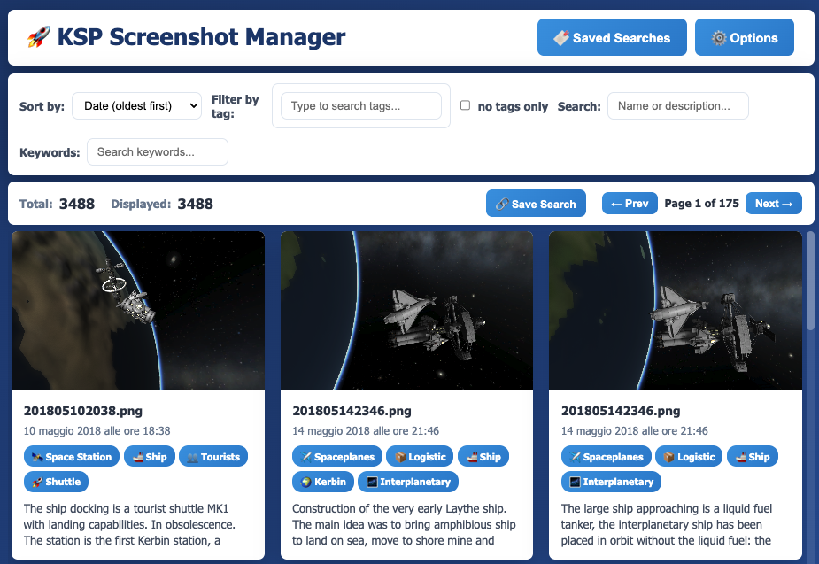
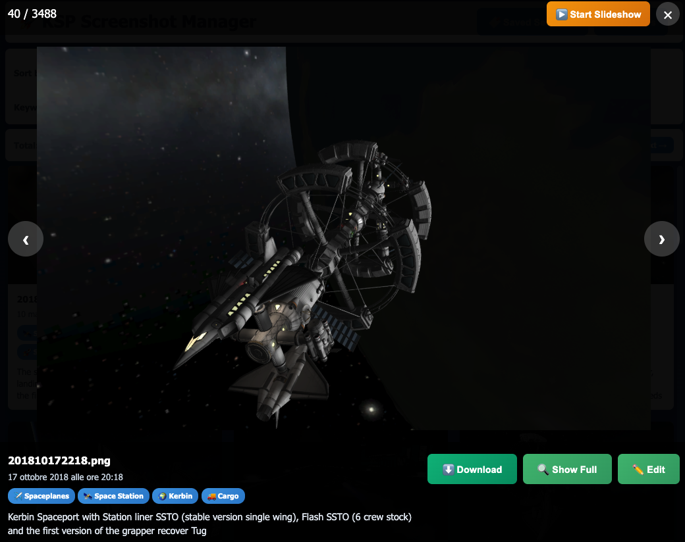
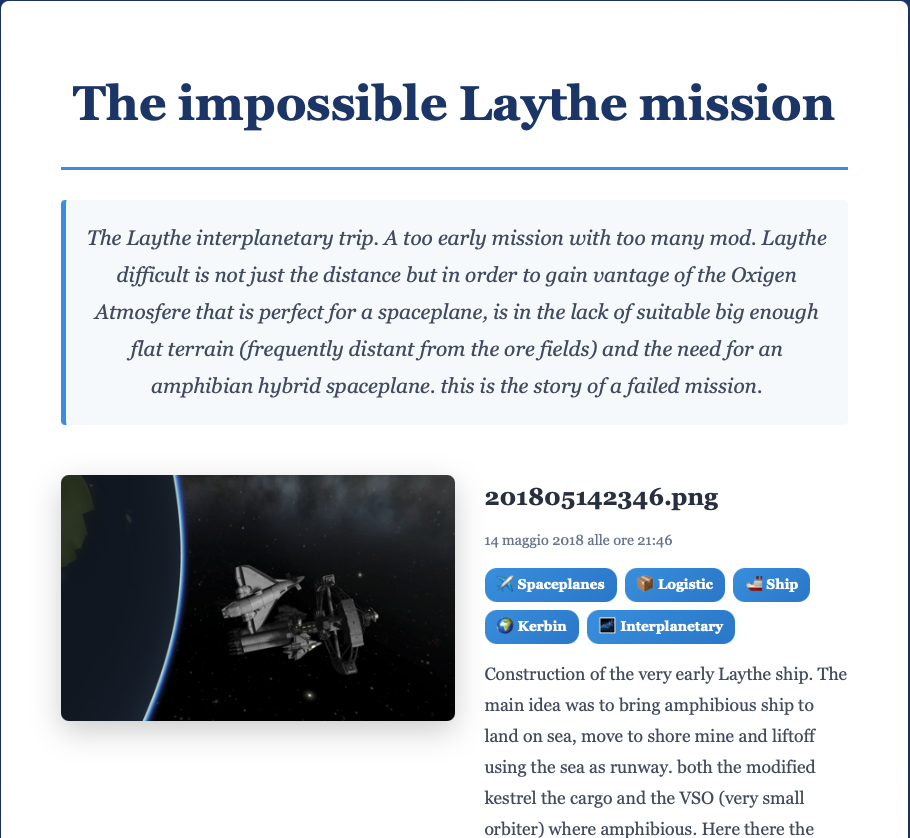

# KSP Screenshot Manager

<div align="center">


**Organize and document your Kerbal Space Program screenshots with AI-powered tagging and mission stories**

[Download Latest Release](https://github.com/pinolallo/ksp-screenshot-manager/releases) | [Report Bug](https://github.com/pinolallo/ksp-screenshot-manager/issues) | [Request Feature](https://github.com/pinolallo/ksp-screenshot-manager/issues)

</div>

---

##  What is it?

KSP Screenshot Manager is a native macOS application that helps you organize, tag, and create mission stories from your Kerbal Space Program screenshots.

###  Key Features

- **Smart Organization** - Import and organize thousands of screenshots
- **Powerful Tagging** - Custom tags + autocomplete interface
- **Mission Stories** - Create narrative documentation with saved searches
- **AI Pattern Recognition** - Auto-suggest tags based on your existing library
- **Advanced Search** - Multi-tag filtering, keywords, date ranges
- **Export/Import** - Full backup to JSON
- **Fast & Offline** - SQLite database, works completely offline
- **Native macOS App** - Clean interface, drag & drop support

---

##  Screenshots

<div align="center">

<p><i>Gallery view with tags and filters</i></p>
</div>

<div align="center">

<p><i>Fullscreen viewer with metadata</i></p>
</div>

<div align="center">

<p><i>Create mission stories with saved searches</i></p>
</div>

---

##  Installation

### Download (Recommended)

#### macOS
1. Download the latest `.dmg` from [Releases](https://github.com/pinolallo/ksp-screenshot-manager/releases)
2. Open the `.dmg` file
3. Drag **KSP Screenshot Manager** to your **Applications** folder
4. Launch from Applications

#### Windows
1. Download the latest `.exe` installer from [Releases](https://github.com/pinolallo/ksp-screenshot-manager/releases)
2. Run the installer
3. Follow the installation wizard
4. Launch from Start menu or desktop shortcut

#### Linux
1. Download the `.AppImage` or `.deb` from [Releases](https://github.com/pinolallo/ksp-screenshot-manager/releases)
2. For `.AppImage`:
   - Make executable: `chmod +x KSP-Screenshot-Manager*.AppImage`
   - Run directly or install via system menu
3. For `.deb`:
   - Install with `sudo dpkg -i KSP-Screenshot-Manager*.deb`
   - Resolve dependencies with `sudo apt-get install -f`

### Build from Source

```bash
# Clone the repository
git clone https://github.com/pinolallo/ksp-screenshot-manager.git
cd ksp-screenshot-manager

# Install dependencies
npm install

# Run in development
npm start

# Build DMG
npm run build:mac-dmg
```

---

##  Quick Start

### 1. Import Screenshots

Click **Options** → **Import Folder** and select your KSP screenshots folder:
```
~/Library/Application Support/Steam/steamapps/common/Kerbal Space Program/Screenshots/
```

### 2. Tag Your Photos

- Click any photo to view
- Click **Edit** to add tags and descriptions
- Use the tag autocomplete for speed

### 3. Create Mission Stories

1. Filter photos by tag (e.g., "Mun" + "Landing")
2. Click **Save Search**
3. Write your mission narrative
4. Get a shareable collection!

---

##  Use Cases

### Mission Documentation
Document your career mode progression with organized photo collections

### Challenge Runs
Track challenge attempts with photos and narratives

### Content Creation
Quickly find specific screenshots for videos or posts

### Base/Station Construction
Chronicle the evolution of your builds over time

### Just Organization
Finally organize those 5,000+ screenshots gathering dust

---

##   Tagging System

### Pre-defined Tags
- **Celestial Bodies**: Kerbin, Mun, Minmus, Duna, Ike, Jool...
- **Mission Types**: Launch, Landing, Docking, EVA, IVA
- **Vehicle Types**: Spaceplanes, Lander, Rover, Station, Ship
- **Other**: Cargo, Tourists, Mining, Experimental

### Custom Tags
Add your own tags for:
- Specific missions ("Jool-5 Challenge")
- Planet packs (OPM, GPP)
- Mods used
- Anything you want!

---

## AI Pattern Recognition

The app learns from your existing tags:

```
After tagging 50-100 photos manually:
→ Analyzes tag co-occurrences
→ Learns keyword associations  
→ Recognizes filename patterns
→ Suggests tags for new photos

Typical accuracy: 70-80%
```

**Example:**
```
Photo: "Mun Landing Mission 5.png"
AI Detects: "mun" + "landing" in filename
Suggests: [🌑 Mun, 🛬 Landing, 🛸 Lander]
Confidence: 95%
```

---

##  Technical Details

### Built With
- **Electron** - Cross-platform desktop framework
- **better-sqlite3** - Fast, synchronous SQLite3
- **Vanilla JavaScript** - No frameworks, pure performance

### Database
- **SQLite** local database
- **Location**: `~/Library/Application Support/ksp-screenshot-manager/`
- **BLOB storage** for images
- **Indexed** for fast queries

### System Requirements
- **OS**: macOS 10.13 or later
- **RAM**: 4GB minimum (8GB recommended for large libraries)
- **Disk**: Depends on your screenshot collection

---

##  Development

### Prerequisites
- Node.js 18+
- npm or yarn
- Xcode Command Line Tools (for native builds)

### Setup
```bash
git clone https://github.com/pinolallo/ksp-screenshot-manager.git
cd ksp-screenshot-manager
npm install
npm start
```

### Build
```bash
# Development
npm start

# Build DMG
npm run build:mac-dmg

# Output: dist/KSP Screenshot Manager-1.0.0.dmg
```

### Project Structure
```
ksp-screenshot-manager/
├── main.js              # Electron main process (backend)
├── preload.js           # IPC bridge
├── renderer/
│   └── index.html       # Frontend UI
├── build/
│   ├── icon.icns        # App icon
│   └── entitlements.mac.plist
└── package.json         # Dependencies & build config
```

---

##  Contributing

Contributions welcome! Please:

1. Fork the repo
2. Create a feature branch (`git checkout -b feature/amazing-feature`)
3. Commit changes (`git commit -m 'Add amazing feature'`)
4. Push to branch (`git push origin feature/amazing-feature`)
5. Open a Pull Request

### Ideas for Contribution
- [ ] Windows/Linux builds
- [ ] Cloud sync (iCloud, Dropbox)
- [ ] Video thumbnail support
- [ ] Timeline view
- [ ] Mission statistics
- [ ] Collaborative stories
- [ ] Plugin system

---

##  Roadmap

### v1.1 (Completed)
- [x] Windows & Linux support
- [ ] Video file support
- [ ] Timeline visualization
- [ ] Batch tagging improvements

### v2.0 (Future)
- [ ] Cloud sync
- [ ] Multi-user collaboration
- [ ] Mobile companion app
- [ ] Integration with KSP mods

---

##  Known Issues

- Large imports (1000+ photos) may take a few minutes
- AI pattern recognition requires at least 10 tagged photos to initialize
- DMG is unsigned (you may need to allow in System Preferences)

See [Issues](https://github.com/pinolallo/ksp-screenshot-manager/issues) for complete list.

---

##  License

This project is licensed under the MIT License - see [LICENSE](LICENSE) file for details.

---

##  Acknowledgments

- Inspired by the amazing KSP community
- Built with love for Kerbonauts everywhere
- Thanks to Squad for creating Kerbal Space Program

---

##  Contact

- **GitHub Issues**: [Report bugs or request features](https://github.com/pinolallo/ksp-screenshot-manager/issues)
- **Email**: sdipietr_at_mac.com
- **KSP Forum**: https://forum.kerbalspaceprogram.com/topic/229792-ksp-screenshot-manager-document-your-missions-as-actual-stories/
- **Reddit**: u/pinolallo

---

<div align="center">

**Made for the KSP Community**

[⬆ Back to Top](#ksp-screenshot-manager)

</div>
